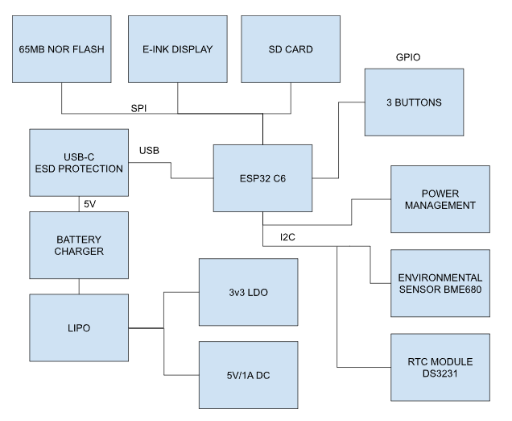

# EBook_Reader

## Block Diagram

## BOM (Bill Of Materials)

| Component  | Supplier Link | Datasheet |
|------------|---------------|-----------|
| 112A-TAAR-R03 | [Model](https://www.snapeda.com/parts/112A-TAAR-R03/Attend/view-part/) | [Datasheet](https://www.snapeda.com/parts/112A-TAAR-R03/Attend/datasheet/) |
| 744043680 | [Model](https://ro.mouser.com/ProductDetail/Wurth-Elektronik/744043680?qs=PGXP4M47uW6VkZq%252BkzjrHA%3D%3D) | [Datasheet](https://www.we-online.com/components/products/datasheet/744043680.pdf) |
| BD5229G-TR | [Model](https://www.digikey.ee/en/models/658502) | [Datasheet](https://www.rohm.com/datasheet?p=BD5229G&dist=Digi-key&media=referral&source=digi-key.com&campaign=Digi-key) |
| Capacitor 0402 | [Model](https://componentsearchengine.com/part-view/CC0402MRX5R5BB106/YAGEO) | [Datasheet](https://componentsearchengine.com/Datasheets/2/CC0402MRX5R5BB106.pdf) |
| CPH3225A | [Model](https://www.snapeda.com/parts/CPH3225A/Seiko+Instruments/view-part/?ref=eda) | [Datasheet](https://www.snapeda.com/parts/CPH3225A/Seiko%20Instruments/datasheet/) |
| Custom Button | [Model](https://industry.panasonic.com/global/en/products/control/switch/light-touch/number/evqpuj02k) | [Datasheet](https://industry.panasonic.com/global/en/downloads?tab=catalog&small_g_cd=203&part_no=EVQPUJ02K) |
| DS3231SN | [Model](https://www.snapeda.com/parts/DS3231SN%23/Analog+Devices/view-part/?ref=eda) | [Datasheet](https://www.snapeda.com/parts/DS3231SN%23/Analog%20Devices/datasheet/) |
| ESP32 WROVER 0805 Capacitor | [Model](https://ro.mouser.com/ProductDetail/KYOCERA-AVX/SD0805S020S1R0?qs=jCA%252BPfw4LHbpkAoSnwrdjw%3D%3D) | [Datasheet](https://ro.mouser.com/datasheet/2/40/schottky-3165252.pdf) |
| ESP32 WROVER BME680 Sensor | [Model](https://www.digikey.ro/en/models/7401317) | [Datasheet](https://www.bosch-sensortec.com/media/boschsensortec/downloads/datasheets/bst-bme680-ds001.pdf) |
| ESP32 WROVER MCP73831 Power Management | [Model](https://www.snapeda.com/parts/MCP73831T-2ACI/OT/Microchip/view-part/) | [Datasheet](https://www.snapeda.com/parts/MCP73831T-2ACI/OT/Microchip/datasheet/) |
| ESP32C6 Varistor 1812 | [Model](https://www.snapeda.com/parts/RC0603JR-070RL/Yageo/view-part/) | [Datasheet](https://www.snapeda.com/parts/RC0603JR-070RL/Yageo/datasheet/) |
| ESP32C6 WROOM-1-N8 | [Model](https://www.snapeda.com/parts/ESP32-C6-WROOM-1-N8/Espressif+Systems/view-part/?ref=eda) | [Datasheet](https://www.snapeda.com/parts/ESP32-C6-WROOM-1-N8/Espressif%20Systems/datasheet/) |
| FH34SRJ-24S-0.5SH | [Model](https://www.snapeda.com/parts/FH34SRJ-24S-0.5SH(99)/Hirose/view-part/) | [Datasheet](https://www.snapeda.com/parts/FH34SRJ-24S-0.5SH(99)/Hirose%20Connector/datasheet/) |
| LED Chip 0603 | [Model](https://grabcad.com/library/0603-smd-led-1) | [Datasheet](https://www.snapeda.com/parts/KP-1608SURCK/Kingbright/datasheet/) |
| MAX17048G+T10 | [Model](https://www.snapeda.com/parts/MAX17048G+T10/Analog+Devices/view-part/?ref=eda) | [Datasheet](https://www.snapeda.com/parts/MAX17048G+T10/Analog%20Devices/datasheet/) |
| MBR0530 Schottky Diode | [Model](https://www.snapeda.com/parts/MBR0530/Onsemi/view-part/?ref=eda) | [Datasheet](https://www.snapeda.com/parts/MBR0530/ON%20Semiconductor/datasheet/) |
| PGB1010603MR | [Model](https://www.snapeda.com/parts/PGB1010603MR/Littelfuse/view-part/?ref=eda) | [Datasheet](https://www.snapeda.com/parts/PGB1010603MR/Littelfuse%20Inc./datasheet/) |
| QWIIC Connector | [Model](https://www.snapeda.com/parts/PRT-14417/SparkFun/view-part/) | [Datasheet](https://www.snapeda.com/parts/PRT-14417/SparkFun%20Electronics/datasheet/) |
| RCL CPOL 3528 | [Model](https://www.snapeda.com/parts/TAJB475K025RNJ/AVX/view-part/?ref=dk&t=capacitor%203528&con_ref=None) | [Datasheet](https://s3.amazonaws.com/snapeda/datasheet/TAJB475K025RNJ_AVX.pdf) |
| Resistor 0402 | [Model](https://componentsearchengine.com/part-view/R0402%201%25%20100%20K%20(RC0402FR-07100KL)/YAGEO) | [Datasheet](https://www.yageo.com/upload/media/product/products/datasheet/rchip/PYu-RC_Group_51_RoHS_L_12.pdf) |
| SI1308EDL-T1-GE3 MOSFET | [Model](https://www.snapeda.com/parts/SI1308EDL-T1-GE3/Vishay+Siliconix/view-part/?ref=eda) | [Datasheet](https://www.snapeda.com/parts/SI1308EDL-T1-GE3/Vishay%20Siliconix/datasheet/) |
| SJ | [Model](https://grabcad.com/library/solder-jumpers-1) | [Datasheet]() |
| TPTP20R | [Model](https://ro.mouser.com/ProductDetail/Adafruit/3825?qs=%252bEew9%252b0nqrAn6n76%252bB5vZg%3D%3D&utm_source=findchips&utm_medium=aggregator&utm_campaign=3825&utm_term=3825&utm_content=Adafruit&_gl=1*1t6jdbp*_ga*MTQ5NTQ1ODI1LjE3NDMyMzgzNTY.*_ga_15W4STQT4T*MTc0Mzc4MDU5Ni4xMi4xLjE3NDM3ODM2MzIuNDIuMC4w) | [Datasheet](https://cdn-shop.adafruit.com/product-files/3825/3825_diagram.PDF) |
| USB4110-GF-A | [Model](https://componentsearchengine.com/part-view/USB4110-GF-A/GCT%20(GLOBAL%20CONNECTOR%20TECHNOLOGY)) | [Datasheet](https://gct.co/files/drawings/usb4110.pdf) |
| USBLC6-2SC6Y | [Model](https://www.snapeda.com/parts/USBLC6-2SC6Y/STMicroelectronics/view-part/?ref=eda) | [Datasheet](https://www.snapeda.com/parts/USBLC6-2SC6Y/STMicroelectronics/datasheet/) |
| W25Q512JVEIQ | [Model](https://www.digikey.ro/en/models/10244706) | [Datasheet](https://www.winbond.com/resource-files/W25Q512JV%20SPI%20RevB%2006252019%20KMS.pdf) |
| XC6220A331MR-G | [Model](https://componentsearchengine.com/part-view/XC6220A331MR-G/Torex) | [Datasheet](https://product.torexsemi.com/system/files/series/xc6220.pdf) |

## Hardware Description
1. Microcontroller - ESP32-C6-WROOM-1-N8
The ESP32-C6 is the core processing unit responsible for handling all system operations, communication with sensors and modules, and power management.
- Architecture: RISC-V 32-bit
- Clock Speed: 160 MHz
- Wireless Connectivity: 2.4 GHz Wi-Fi 6, Bluetooth 5.0

2. Power Management & Battery
Battery Type: Li-Po (Lithium Polymer)
- Capacity: 3.7V, 1800mAh
- Charging Circuit: MCP73831T
- Input Voltage: 5V via USB-C
- Protection Features: Overcharge and deep discharge protection
- Voltage Regulator: LDO regulator ensures a stable 3.3V power supply to all components.

3. Display - E-Paper (E-Ink) Screen
- Size: 7.5 inches
- Resolution: 800x480 pixels
- Communication Interface: SPI

4. SD Card Module
- Type: MicroSD (Supports FAT32)
- Interface: SPI

5. External NOR Flash
- Capacity: 64MB
- Interface: SPI

6. Environmental Sensor - BME688
- Functions: Measures temperature, humidity, air pressure, and gas levels.
- Communication Interface: I2C

7. Real-Time Clock (RTC) - DS3231SN
- Functionality: Maintains time and date even when the system is powered off.
- Communication Interface: I2C

8. USB-C Connector & ESD Protection
- Functionality: Provides power input and data transfer capability.
- Protection: Integrated ESD protection and Schottky diode for reverse polarity safety.

9. Buttons & User Input
- Tactile Push Buttons

10. Communication Interfaces
- GPIO: Used for button controls and general I/O operations.
- SPI: Used for SD card, external flash memory, and e-paper display.
- I2C: Used for the BME688 environmental sensor and DS3231SN RTC module.
- UART: Used for debugging and serial communication.
- Wi-Fi & Bluetooth: Provided by ESP32-C6, allowing wireless connectivity.

## Power Consumption Estimation
| Component                | Current Draw (mA) | Voltage (V) | Power (mW) |
|--------------------------|------------------|-------------|------------|
| **ESP32-C6 (Wi-Fi active)** | 200             | 3.3         | 660        |
| **E-Paper Display (Updating)** | 40        | 3.3         | 132        |
| **BME688 Sensor (Measuring)**  | 3.1       | 3.3         | 10.23      |
| **RTC Module (Active)**        | 0.15      | 3.3         | 0.495      |
| **SD Card (Active)**           | 50        | 3.3         | 165        |
| **External NOR Flash**         | 25        | 3.3         | 82.5       |
| **Total Estimated Power Consumption** | **~318.5mA** | 3.3V | **1050.72 mW** |

## ESP32-C6 Pin Mapping  

| Component                | ESP32-C6 Pin(s) | Interface | Purpose |
|--------------------------|----------------|-----------|---------|
| **E-Paper Display**      | IO7 (MOSI), IO6 (SCK), IO10 (CS), IO5 (DC), IO23 (RST), IO3 (BUSY) | SPI | Transfers image data to the display and controls its state. |
| **MicroSD Card**         | IO7 (MOSI), IO6 (SCK), IO4 (SS_SD), IO2 (MISO) | SPI | Allows storage and retrieval of e-book files. |
| **Environmental Sensor (BME688)** | IO21 (SDA), IO22 (SCL) | I2C | Reads temperature, humidity, pressure, and air quality data. |
| **RTC Module (DS3231)**  | IO21 (SDA), IO22 (SCL), IO18 (RST), IO1 (32KHz), IO0 (INT_RTC) | I2C | Keeps track of time even when ESP32 is off. |
| **External NOR Flash**   | IO11 (CS), IO6 (SCK), IO2 (MISO), IO7 (MOSI) | SPI | Provides additional storage for application data. |
| **Battery Monitoring**   | IO21 (SDA), IO22 (SCL) | I2C | Reads battery voltage and charge status. |
| **USB-C Connection**     | GPIOs through voltage regulation | USB | Powers and programs the ESP32-C6. |
| **Control Buttons**      | IO9 (BOOT), IO15 (CHANGE), EN (RESET) | GPIO | User input for device interactions. |

## Additional Design Notes  

- **Footprint Adjustments**:  
  - The **744043680 inductor** and **USB-C connector** footprints were modified to prevent design rule check (DRC) errors.  

- **Power Routing Constraints**:  
  - Not all power traces could be routed on the **top layer**, requiring some to be placed on the **bottom layer**.  
  - A **ground plane** is present on both the **top** and **bottom layers** for improved signal integrity and noise reduction.  

- **Component Placement**:  
  - The **component layout** closely follows the reference document to ensure optimal spacing and routing efficiency.  
  - The **battery fits perfectly** next to the PCB inside the enclosure.  

- **Button Alignment Issues**:  
  - The buttons **do not align perfectly** with their footprints, but they (hopefully) remain functional.  

- **Test Pads Size**:  
  - The **test pads are slightly larger** than ideal, which may affect probe contact but improves soldering accessibility.  

- **Via Count and Stitching**:  
  - The design includes **79 vias**, which is a reasonable number for a project of this complexity.  
  - **Via stitching** was applied near the **ESP32-C6** to:  
    - Improve **ground return paths**.  
    - Manage **ground loops**.  
    - Enhance **heat dissipation**.  
    - Reduce **electromagnetic interference (EMI)**.  
